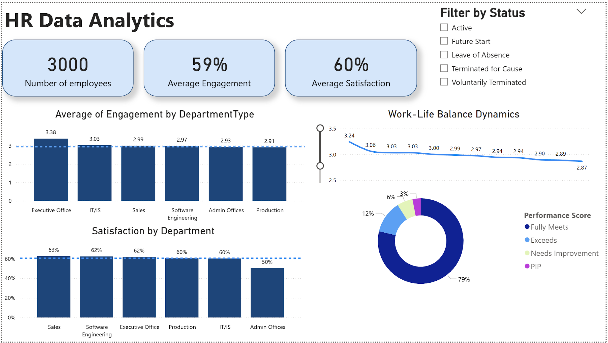

# hr-analytics-powerbi-dashboard

-------------------------------------------------------------------------------

This project analyzes key workforce metrics through an interactive Power BI dashboard focused on employee engagement, work-life balance, and performace outcomes. The dashboard is designed to help stakeholders monitor HR trends, compare departments, and evaluate employee experience metrics across the organization.

Interactive filtering allows users to explore workforce patterns by employee status, making it easier to identify performance differences, engagement gaps, and potential areas for HR intervention.

## Business Use Case

This dashboard can support HR and leadership teams in tracking emplpoyee health metrics, comparing departmental performance, and informing decisions related to rentention, engagement, and workforce planning. 

## Key Insights
- Average engagement is 58%, while average satisfaction is 62%, suggesting satisfactionis slightly stronger than employee engagement overall.
- The filtered employee group contains 321 employees, providing a focused view of workforce conditions by status.
- Department-level comparisons reveal uneven engagement and satisfaction, which may indicate differences in management, workload, or team culture.
- Work-life balance trends vary over time, which can hekp HR teams identify periods of lower employee experience and target interventions.
- Performance score distribution is concentrated in the highest category, with a much smaller share of emplooyees in lower performance bands.

---------------------------------------------------------------------------------

### Dashboard Preview

